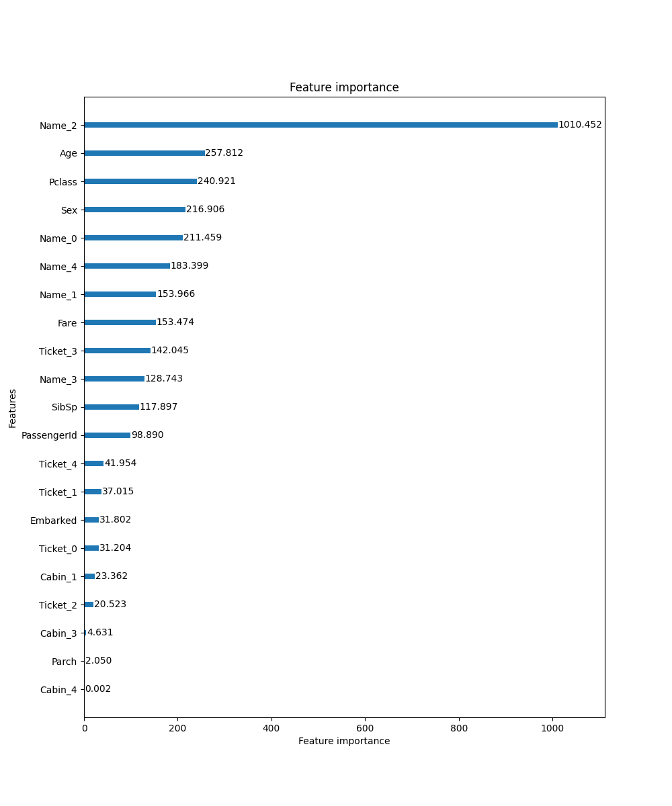

# Predict titanic survival

I use similiarity encoding from the dirty_cat package to encode Name, Ticket, and Cabin numbers. It's an efficient way to deal with high-cardinality categories while maintaining most signal with zero manual preprocessing. Automatic is better if it yields the same results!

The final feature importance list is found here:

I was able to achieve validation accuracy of 82.51%. Pretty good for 10 minutes of work.
